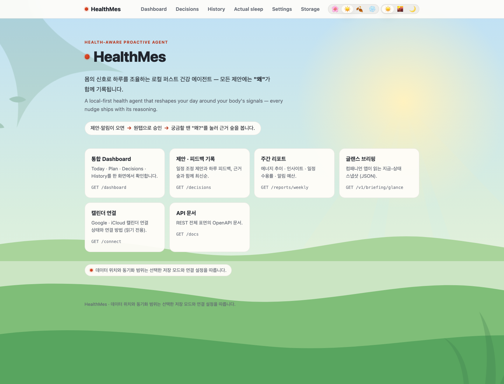
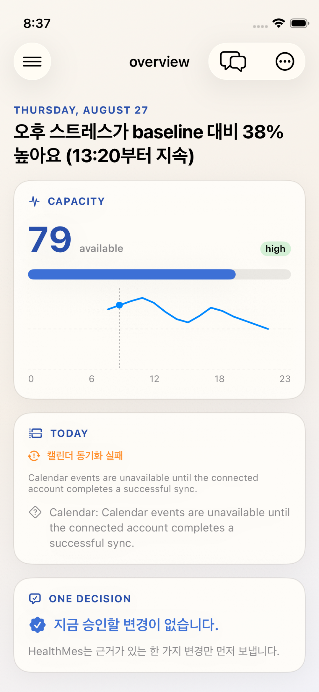
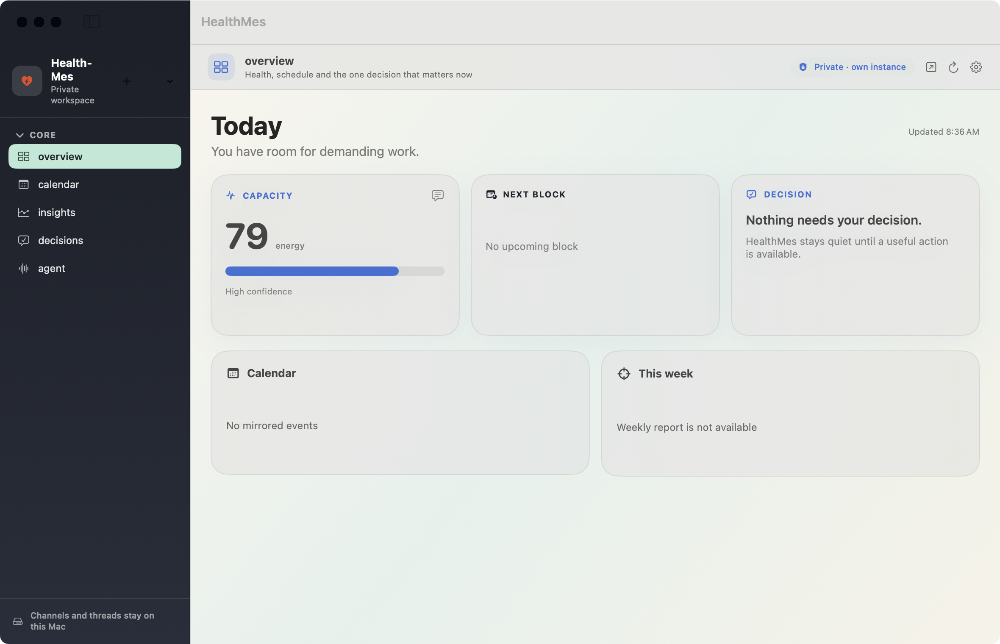
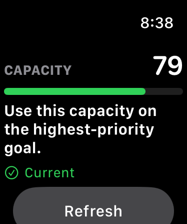

# 🧠 HealthMes Agent

**Open, local-first infrastructure for wellness agents.**

HealthMes turns wearable, activity, nutrition, calendar, environment, and
subjective signals into explainable decisions and practical next steps. It
gives the same wellness context to a web workspace, iPhone, Apple Watch,
macOS, Android, Wear OS, Windows, and Telegram without handing your data to a
third-party relay.

> HealthMes is personal software, not a medical device and not a substitute
> for professional medical advice.

## 🧭 Index

- [What is HealthMes?](#-what-is-healthmes)
- [Everything That Is Built](#-everything-that-is-built)
- [Input Architecture](#-input-architecture)
- [Product Gallery](#-product-gallery)
- [Quick Start](#-quick-start)
- [Mac → iPhone → Apple Watch](#-mac--iphone--apple-watch)
- [Choose Your Path](#-choose-your-path)
- [Companion Apps](#-companion-apps)
- [How It Works](#-how-it-works)
- [Data Sources and Integrations](#-data-sources-and-integrations)
- [Security and Privacy](#-security-and-privacy)
- [Build Matrix](#-build-matrix)
- [Documentation](#-documentation)

## 🌿 What is HealthMes?

HealthMes is the glue plane between personal data and wellness automation:

```text
signals → normalized context → explainable decision → user action → outcome
```

The system combines:

- **Context:** wearable recovery, sleep, HRV, stress, body battery, activity,
  nutrition, calendar load, environment, app fragmentation, and manual
  captures.
- **Reasoning:** deterministic energy and trigger engines plus one canonical
  free-form reasoning path through the Hermes runtime.
- **Action:** bounded proposals, exact Yes/No/Speak actions, schedule changes,
  capture flows, reports, and proactive notifications.
- **Inspection:** decision records, evidence, confidence, coverage, and local
  Mermaid flowcharts instead of opaque recommendations.

## ✅ Everything That Is Built

| Surface | Implemented product experience |
|---|---|
| 🌐 Web workspace | Integrated dashboard with overview, calendar, insights, decisions, agent channels, setup, input controls, reports, and decision flowchart viewer |
| 🧠 Decision runtime | `POST /v1/wellness-decisions` → `HealthMesDecisionService` → Hermes `/v1/responses` → filtered HealthMes MCP tools |
| 📱 iPhone | Full wellness canvas, Today/Plan/Explore/Settings flows, voice and editable-text dock, calendar blocks, capture, reports, bounded decisions, notifications, widgets, and Live Activities |
| ⌚ Apple Watch | iPhone-paired compact decision remote, notification actions, spoken-command relay, watch app, and complications |
| 🖥️ macOS | Full SwiftUI workspace, local threads, sidebar and inspector, menu bar glance/popover, bounded voice/text commands, widgets, notifications, and ambient screensaver |
| 🤖 Android | Compose companion with Home, Report, Capture, Proposals, Settings, real notification actions, ongoing focus block, and an ETag-aware widget |
| ⌚ Wear OS | Standalone pairing activity, cache-first ProtoLayout briefing tile, energy complication, and phone notification bridge |
| 🪟 Windows | .NET 8 tray/flyout, toast actions, privacy-aware `.scr` screensaver, DPAPI pairing, and Widgets Board integration point |
| ✈️ Telegram + Hermes | Guaranteed-delivery channel, proactive briefings, capture skill, cron scheduling, and agent chat |
| 💾 Storage | Local SQLite or PostgreSQL, Redis-backed runtime paths, retention controls, age-encrypted backups, and optional ciphertext-only remote vault |

### One Canonical Decision Path

The native clients and web UI consume the same decision contract. The reasoning
runtime exposes six read-oriented tools:

```text
POST /v1/wellness-decisions
        ↓
HealthMesDecisionService
        ↓
Hermes /v1/responses
        ↓
Filtered HealthMes MCP
        ├─ search_activity
        ├─ search_nutrition
        ├─ search_calendar
        ├─ search_wearable
        ├─ list_wellness_skills
        └─ read_wellness_skill
```

Every response can carry evidence, confidence, coverage, and
`insufficient_data` rather than inventing certainty.

## 🎛️ Input Architecture

Inputs are a first-class control plane, not a collection of one-off provider
toggles. Web, iPhone, and macOS settings render the same server-owned
descriptors from `GET /v1/inputs`, so capabilities, connection state,
collection state, privacy notes, retention, and available actions stay
consistent across clients.

### The four inputs that shape a decision

HealthMes treats inputs as user-controlled domains. Each domain can be
connected, paused, scoped, retained, and exposed to the Decision Agent
independently.

| Input | Sources | What HealthMes does with it |
|---|---|---|
| 🍽️ **Nutrition** | Photo capture, text, voice transcript, caffeine and food observations | Stores the original capture first, then normalizes bounded observations such as item, meal, caffeine, confidence, and confirmation state. Photo VLM output is an observation, not an unquestioned fact; the user can correct or mark the result as consumed, not consumed, or unknown. |
| ⌚ **Open Wearables** | HealthKit bridge plus the separate Open Wearables data plane and its 11 provider integrations | Reads recovery, sleep, HRV, stress, readiness, body battery, strain, workouts, and supported time series through HealthMes's read-only REST adapter. HealthMes does not connect Hermes directly to the vendor MCP or modify `vendor/open-wearables/`. |
| 🖥️ **Activity Monitoring** | ActivityWatch desktop, Android UsageStats, and eligible iPhone Screen Time aggregate | Converts foreground, idle, category, and app-usage summaries into canonical activity events for fragmentation and focus context. The privacy boundary excludes screenshots, keystrokes, URLs, and app content. Activity ingest is separate from Open Wearables ingest. |
| 📅 **Calendar** | Google Calendar API and iCloud Calendar over CalDAV | Mirrors events, availability, schedule density, and sync metadata for planning. External events remain the source of truth; HealthMes proposes changes and requires explicit approval before changing an eligible HealthMes-owned block. It never silently edits a user's calendar. |

The source registry behind these domains includes:

| Source ID | Domain | Collection boundary |
|---|---|---|
| `nutrition.capture` | Nutrition | Photo VLM, text, voice transcript, nutrition, and caffeine capture |
| `wearable.healthkit-bridge` | Open Wearables | iPhone HealthKit collector, encrypted outbox, and optional forwarding |
| `wearable.open-wearables` | Open Wearables | Read-only REST mirror of wearable provider data |
| `activity.activitywatch` | Activity Monitoring | Desktop foreground and idle activity summaries |
| `activity.android` | Activity Monitoring | Android UsageStats app/category aggregates |
| `activity.ios-screentime` | Activity Monitoring | Eligible iPhone Screen Time hourly app/category contract |
| `calendar.google` | Calendar | Google Calendar mirror and sync |
| `calendar.icloud` | Calendar | iCloud CalDAV mirror and sync |

Every normalized record carries provenance, confidence or coverage where
applicable, consent scope, retention class, and source/domain/data-class
permissions. Missing data stays missing: engines omit unavailable factors and
return `insufficient_data` instead of manufacturing certainty.

### Control Plane

```text
GET  /v1/setup/readiness
GET  /v1/inputs
GET  /v1/inputs/{source_id}
PUT  /v1/inputs/{source_id}/settings
```

Each `InputSourceDescriptor` includes:

- `instances`: device identity, platform, permission, effective collection
  state, coverage, last collection/upload, pause state, and exclusions.
- `settings`: UI-renderable keys with type, scope, and allowed values.
- `actions`: whether an action runs on the device, server, browser, external
  provider, or local CLI. These are UI contracts, not a generic RPC surface.
- `privacy`: raw-content collection, source-side exclusions, and default
  Decision Agent exposure.
- `retention`: data-class policies using `1d`, `7d`, `14d`, `30d`, `90d`, or
  `forever`.
- `limitations`: OS, entitlement, provider, or build-specific constraints.

Settings have explicit scopes:

| Scope | Examples |
|---|---|
| Instance | Device `enabled`, `paused_until`, and excluded apps |
| Source | Enable or disable one source without changing the whole domain |
| Domain | Allow the Decision Agent to query activity, nutrition, wearable, or calendar context |
| Data class | Retention for raw, hourly, daily, media, or provider snapshot data |

### Safe Concurrent Updates

Settings use compare-and-swap semantics. A client must read the current
descriptor, preserve only the user's pending fields, and send the exact strong
`ETag` back as `If-Match`:

```text
GET /v1/inputs/{source_id}
        ↓
render descriptor + remember ETag
        ↓
PUT /v1/inputs/{source_id}/settings
If-Match: "<descriptor revision>"
        ↓
200 updated descriptor
or
428 missing revision / 409 stale revision
        ↓
re-read descriptor, reapply the pending patch, resolve conflicts
```

The server rejects stale writes atomically. A `409
input_settings_revision_conflict` never partially applies collection,
retention, or Decision access changes. After a successful write, the response
body and response `ETag` become the next editing baseline.

### Raw-First Ingest

All incoming payloads are durable before parsing or forwarding:

```text
device/provider
      ↓
POST /v1/ingest/healthkit   or   POST /v1/ingest/raw
      ↓
raw bytes + sha256 + size + source index
      ↓
parse and normalize
      ↓
forward to canonical activity/wearable records
      ↓
decision context, alerts, reports, and client APIs
```

`POST /v1/ingest/healthkit` accepts the first-party
`healthmes.healthkit.v1` batch and legacy HealthKit exporters. The server
returns a durable acknowledgement with the raw object identity, parse status,
forward status, hash, and byte size. Duplicate first-party batches are
idempotent; deletion batches use tombstones and fail closed until canonical
records can be removed.

The iPhone HealthKit collector adds a pairing-scoped encrypted outbox. It
stores exact request bytes, a stable `Idempotency-Key`, and candidate anchors;
anchors advance only after a durable `202` acknowledgement with matching hash,
size, and accepted forwarding state. Android UsageStats follows the same
privacy boundary: no screenshots, keystrokes, URLs, or app content are
collected.

For the complete contract, including error codes, retention scope, lifecycle
fences, and platform-specific behavior, see
[`docs/INPUT-CONTROL-PLANE.ko.md`](docs/INPUT-CONTROL-PLANE.ko.md).

## 🖼️ Product Gallery

These screenshots were refreshed from the current `main` code on August 26,
2026 using seeded local data. They show the real Web entrypoint, macOS
workspace, iPhone Today canvas, and paired Apple Watch surface. The Web
surface is the service entrypoint (`/`); current `main` does not expose a
`/dashboard` route. The Watch implementation also has an actionable decision
remote and interactive notification category with **No / Yes / Speak**; the
shown Watch frame is the glance state because the simulator did not surface a
pending proposal during this capture.

| Web | iPhone |
|---|---|
| **Web entrypoint**<br> | **iPhone Today**<br> |

| macOS | Apple Watch |
|---|---|
| **macOS workspace**<br> | **Apple Watch remote**<br> |

## ⚡ Quick Start

The fastest path is a local SQLite-backed service. It needs no PostgreSQL,
Redis, wearable credentials, or Telegram configuration.

### 1. Install and start

Requirements: Python 3.12+ and [`uv`](https://docs.astral.sh/uv/).

```bash
uv sync
make mac-run
```

Keep this terminal running. `make mac-run` starts the local HealthMes service
on `http://localhost:8100`; the macOS companion and the iPhone/Watch
companions all consume this same instance.

### 2. Verify the service

In a second terminal:

```bash
curl http://localhost:8100/health
curl http://localhost:8100/v1/briefing/glance
```

Expected:

```json
{"status":"ok"}
```

The glance response should contain an energy score, a 24-hour curve, alert
state, and the latest decision when demo data is available.

### 3. Connect the Apple surfaces

For the shortest end-to-end path:

1. Keep the HealthMes service running on the Mac.
2. Pair the iPhone with the same instance from **Settings**. Use HTTPS for a
   real iPhone; loopback HTTP is only for a local simulator.
3. Launch HealthMes on the paired Apple Watch. WatchConnectivity transfers the
   pairing; the Watch then shows the current glance or an actionable decision.
4. When a proposal is pending, choose **No**, **Yes**, or **Speak** on the
   Watch. **Speak** opens the watch text-input/voice reply path and relays the
   reviewed command through the iPhone.

The Mac, iPhone, and Watch do not maintain separate wellness backends. They
read the same HealthMes instance and preserve the proposal identity through
each action.

### 4. Open the Web workspace

| URL | Use |
|---|---|
| `http://localhost:8100/` | Web entrypoint with links to local surfaces |
| `http://localhost:8100/docs` | OpenAPI documentation |
| `http://localhost:8100/decisions` | Decision history and flowcharts |
| `http://localhost:8100/reports/weekly` | Human-readable weekly report |
| `http://localhost:8100/reports/weekly.json` | Machine-readable weekly report |
| `http://localhost:8100/connect` | Calendar and integration connection |

The native iPhone, Apple Watch, and macOS workspaces use the same briefing,
input, decision, alert, and report contracts. Do not use `/dashboard` with the
current `main` service; use `/`, `/decisions`, or `/reports/weekly` instead.

Stop the service with `Ctrl-C`.

### 5. Try the API

```bash
curl http://localhost:8100/v1/briefing/glance
curl http://localhost:8100/v1/alerts
curl http://localhost:8100/v1/setup/readiness
curl http://localhost:8100/v1/inputs
```

These are the same server-owned contracts used by the native companion apps.

## 🍎 Mac → iPhone → Apple Watch

Use this path when you want the complete Apple companion flow. The Mac and
iPhone are the setup surfaces; the Watch is a compact remote that receives
the active pairing from the iPhone through Apple's encrypted WatchConnectivity
channel.

### Mac: start the instance and pair the Mac app

1. Start HealthMes with `make mac-run`, or use `make mac-setup` for the full
   PostgreSQL + Redis development stack.
2. Build and launch the macOS companion:

   ```bash
   cd apps/macos-companion
   xcodegen generate
   xcodebuild -project HealthMesMac.xcodeproj -scheme HealthMesMac \
     -destination "platform=macOS" build CODE_SIGNING_ALLOWED=NO
   open <DerivedData>/Build/Products/Debug/HealthMesMac.app
   ```

3. In the app, open **Settings → Set up this Mac**. For an existing instance,
   use **Settings → Advanced → Self-host pairing**.

The macOS workspace should show the current capacity/glance state, alerts,
decisions, calendar, reports, local threads, and input controls. The menu bar
glance, widgets, notifications, and ambient screensaver use the same pairing.

### iPhone: pair to the same HealthMes instance

For a real iPhone, the pairing URL must be HTTPS:

1. Let the Mac app generate its five-minute QR code.
2. Scan it with the iPhone Camera.
3. iPhone exchanges the one-time code, stores the long-lived token in the
   Keychain, and performs the first glance/alert sync.
4. Open **Settings** in the iPhone app to inspect connection, input sources,
   HealthKit, calendar, storage, notification, widget, and Live Activity
   controls.

For a same-Mac simulator smoke test, loopback HTTP is intentionally allowed:

```bash
cd apps/ios-companion
xcodegen generate
xcodebuild -project HealthMesCompanion.xcodeproj -scheme HealthMesCompanion \
  -destination "platform=iOS Simulator,name=iPhone 17 Pro,OS=26.2" \
  build CODE_SIGNING_ALLOWED=NO
xcrun simctl install booted <BUILT_PRODUCTS_DIR>/HealthMesCompanion.app
xcrun simctl launch booted com.healthmes.companion \
  -healthmes-ui-test-base-url http://127.0.0.1:8100
```

The iPhone Today screen should show the capacity score and curve, current
alerts, one decision surface, and any synced schedule blocks. If it says
“Could not reach your instance”, check that the local server is still running
and that the simulator launch argument uses the same port.

### Apple Watch: receive the phone pairing

1. Build and install the embedded Watch app with the iPhone companion.
2. Launch the paired iPhone app first.
3. Launch **HealthMes** on Apple Watch. The iPhone sends the current pairing
   through WatchConnectivity; the Watch stores its own local copy and refreshes
   its complication/widget surfaces.
4. Use the Watch for the compact capacity glance, decision actions,
   notification actions, and spoken-command relay. The iPhone remains the
   source of HealthKit collection and the Watch does not become a standalone
   health-data store.

The Watch screen should show a capacity value and a **Current** or actionable
decision state. **Offline** means the Watch has not received a valid pairing
context yet; launch the iPhone app once more while both simulator devices are
paired.

### Cross-device verification

| Check | Expected result |
|---|---|
| Mac app | Workspace loads glance, alerts, decisions, reports, and settings |
| iPhone app | Today/Plan/Explore/Settings load from the same base URL |
| Apple Watch | Capacity and decision remote are populated, not offline |
| Notifications | Alert and proposal actions route to the exact server record |
| Widgets | Energy, next block, alert, and freshness values use the shared cache |
| Live Activities | Decision and focus-block status show explicit action/expiry state |
| Input settings | Web, iPhone, and Mac show the same `/v1/inputs` descriptors |

## 🧩 Choose Your Path

| Goal | Start here | Result |
|---|---|---|
| Explore locally | `uv sync && make mac-run` | Credential-free SQLite demo |
| Use the full Mac-native stack | `make mac-setup` | PostgreSQL, Redis, migrations, and service |
| Run everything in containers | [Docker Compose](#-docker-compose) | HealthMes, open-wearables, Redis, PostgreSQL, and Hermes |
| Add wearable data | [Development guide](docs/DEVELOPMENT.md) | Provider OAuth, sync workers, and credentials |
| Install a companion | [Companion Apps](#-companion-apps) | Pair an iPhone, Mac, Android, Watch, Wear OS, or Windows client |
| Receive proactive messages | [Telegram and Hermes](#telegram-and-hermes) | Briefings, capture, and agent chat |

## 🛠️ Full Mac-Native Setup

The macOS path is the primary local development path. It installs PostgreSQL
16 and Redis with Homebrew without registering global services. Runtime data
stays under `./data/`.

```bash
make mac-setup
install -m 600 .env.example .env
make mac-run
```

Useful commands:

```bash
make mac-services-status
make mac-services-stop
make mac-test
make mac-ow
make mac-ow-worker
make mac-ow-beat
```

The complete wearable path needs PostgreSQL and multiple long-running
processes. Provider OAuth and dogfooding instructions are in
[`docs/DEVELOPMENT.md`](docs/DEVELOPMENT.md).

## 🐳 Docker Compose

```bash
install -m 600 .env.example .env
install -m 600 config/open-wearables.env.example config/open-wearables.env
python3 -c "import secrets; print(secrets.token_urlsafe(32))"
```

Put the generated token in `.env` before starting:

```dotenv
HEALTHMES_API_TOKEN=paste-a-new-token-here
HEALTHMES_TIMEZONE=Asia/Seoul
```

HealthMes binds to all interfaces in Compose and refuses to start without a
bearer token.

```bash
docker compose up -d --build
curl http://localhost:8100/health
docker compose ps
docker compose logs -f healthmes
docker compose down
```

For Hermes credentials and the full compose walkthrough, see
[`docs/DEVELOPMENT.md`](docs/DEVELOPMENT.md#full-stack-docker-compose-alternative-path).

## 📲 Companion Apps

All native clients pair with your own HealthMes instance and share the same
bearer-authenticated APIs. They use ETag/304 caching and pinned fixtures so
glance surfaces remain consistent across platforms.

### 🍎 iPhone and Apple Watch

Source: [`apps/ios-companion/`](apps/ios-companion/)

- iPhone wellness canvas with Today, Plan, Explore, Settings, calendar
  blocks, goals, tasks, reports, capture, and decision details.
- Voice and editable-text command dock for bounded wellness actions.
- Local notifications from `/v1/alerts` with exact `proposal_id` routing and
  **Yes / No / Speak** actions.
- Decision Live Activity with action buttons and explicit expiration states.
- Focus-block Live Activity with timer and progress.
- Home and Lock Screen widgets for energy, next blocks, and alerts.
- Apple Watch remote paired through WatchConnectivity, with compact decision
  actions, notification actions, spoken-command relay, app, and complication.
- First-party HealthKit collector on iPhone with a pairing-scoped encrypted
  outbox, stable `Idempotency-Key`, retry, durable hash/size ACK, and anchor
  advancement only after accepted forwarding state.
- Real device pairing requires HTTPS. Loopback HTTP is for local development
  only.

### 🖥️ macOS

Source: [`apps/macos-companion/`](apps/macos-companion/)

- Full SwiftUI workspace with sidebar, channels, local workspace threads,
  inspector, calendar, goal, task, decision, and report views.
- Bounded voice/text commands and local workspace state.
- `HealthMesMac` main app plus menu bar glance/popover.
- `HealthMesMacWidgets` WidgetKit extension.
- `HealthMesSaver` `.saver` ambient briefing with a privacy toggle that
  removes health-derived values while retaining schedule and freshness.
- Notification manager polls `/v1/alerts`, follows the proposal grammar, and
  supports exact Yes/No actions with outcome handling.
- Setup can install/manage a local runtime and generate a one-time QR pairing
  code.

### 🤖 Android and Wear OS

Source: [`apps/android-usage/`](apps/android-usage/)

- `:companion`: Jetpack Compose app with Home, Report, Capture, Proposals, and
  Settings.
- Home energy score, energy curve, next blocks, alerts, and decision links.
- Camera/photo/voice capture flows.
- Real notification buttons: **Apply / Adjust / Keep**, routed to the exact
  proposal endpoint with explicit 409 already-resolved handling.
- Ongoing focus-block notification with countdown, bridged from phone to Wear.
- Glance widget with a 15-minute ETag-aware refresh.
- `:wear`: standalone pairing activity, cache-first ProtoLayout briefing tile,
  energy complication, and compact wearable briefing.
- `:app`: Android UsageStats collector with encrypted pairing, collection
  generation, privacy boundary, and HTTPS-only telemetry origin.

### 🪟 Windows

Source: [`apps/windows-companion/`](apps/windows-companion/)

- .NET 8 solution with portable `HealthMes.Glance.Core`.
- Tray icon, flyout briefing, toast notifications, and proposal actions.
- `.scr` screensaver supporting `/s`, `/p`, and `/c` modes.
- Privacy toggle for removing health-derived values from ambient surfaces.
- DPAPI-backed pairing and secure local configuration.
- Widgets Board provider integration point is present; packaging/signing is
  intentionally deferred because it requires an MSIX/signing environment.

### ✈️ Telegram and Hermes

HealthMes remains paired to your local instance while Hermes provides the
agent runtime, skills, memory, cron, Telegram gateway, and MCP client.

```bash
uv run python scripts/bootstrap.py --dry-run
uv run python scripts/bootstrap.py
```

Bootstrap renders Hermes configuration outside `vendor/`, installs HealthMes
skills, and registers morning, evening, and weekly briefings.

For terminal chat without Telegram:

```bash
cd vendor/hermes-agent
HERMES_HOME=~/.hermes \
  UV_PROJECT_ENVIRONMENT=../../data/hermes-venv \
  uv run --frozen --no-dev --extra messaging hermes
```

Telegram is the guaranteed-delivery channel. Native notifications are
polling- and OS-budgeted companions, not a replacement for Telegram delivery.

## 🔌 How It Works

This is the top-level system boundary: HealthMes owns the product contract,
canonical storage, normalization, policy, and delivery; Hermes owns the
autonomous reasoning loop; Open Wearables remains a separate read-only data
plane; clients never call either vendor runtime directly.

```text
                                      +-------------------------------------+
                                      |           USER SURFACES              |
                                      | Web  macOS  iPhone  Apple Watch      |
                                      | Android  Wear OS  Windows  Telegram  |
                                      +------------------+------------------+
                                                         | REST / JSON
                                                         | inputs, glance,
                                                         | alerts, reports
+----------------------------------------------------------------------------------------------------------------+
|                                          HEALTHMES PRODUCT PLANE                                              |
|                                                                                                                |
|  +----------------------+    +----------------------+    +-----------------------------------------------+   |
|  | INPUT ADAPTERS       |    | CONTROL + POLICY     |    | CANONICAL DOMAIN SERVICES                     |   |
|  | Nutrition            |--->| /v1/inputs           |--->| raw-first ingest, normalization, provenance  |   |
|  | Open Wearables       |    | consent, retention   |    | activity, nutrition, calendar, wearable       |   |
|  | Activity Monitoring  |    | source/data scopes   |    | energy, triggers, goals, tasks, reports       |   |
|  | Calendar             |    | ETag / If-Match CAS  |    | alerts, proposals, decision records           |   |
|  +----------+-----------+    +----------------------+    +-------------------------+---------------------+   |
|             |                                                                      |                     |
|             | durable raw bytes + canonical records                                 | bounded context     |
|             v                                                                      v                     |
|  +------------------------------------------------------------------------------------------------------+  |
|  | STORAGE + DURABILITY                                                                                  |  |
|  | SQLite/PostgreSQL, raw ingest/media, encrypted HealthKit outbox, Redis runtime, encrypted backups  |  |
|  +------------------------------------------------------------------------------------------------------+  |
|                                                                                                                |
|  +------------------------------------------------------------------------------------------------------+  |
|  | HEALTHMES MCP: search_activity, search_nutrition, search_calendar, search_wearable                 |  |
|  |                list_wellness_skills, read_wellness_skill                                             |  |
|  +------------------------------------------------------+-----------------------------------------------+  |
+---------------------------------------------------------|------------------------------------------------------+
                                                          | filtered, read-oriented MCP only
                                                          v
                          +----------------------------------------------------------------+
                          | HERMES AGENT RUNTIME                                         |
                          | autonomous LLM + tool loop, skills, memory, cron, Telegram  |
                          | POST /v1/responses                                            |
                          +-------------------------------+--------------------------------+
                                                          | evidence, confidence, source refs
                                                          v
                          +----------------------------------------------------------------+
                          | DECISION + DELIVERY                                         |
                          | deterministic trigger -> Hermes reasoning -> record       |
                          | alert -> proposal -> explicit Yes / No / Speak -> outcome  |
                          +----------------------------------------------------------------+

  Apple Watch data path:
  Apple Watch --HealthKit--> iPhone collector --encrypted outbox-->
  POST /v1/ingest/healthkit --durable ACK/hash/size--> canonical records

  Vendor boundaries:
  HealthMes --OWClient REST read-only--> vendor/open-wearables/ (separate data plane)
  HealthMes --rendered config and skills outside vendor--> vendor/hermes-agent/
```

The canonical question path is:

```text
Client -> POST /v1/wellness-decisions -> Hermes /v1/responses
       -> filtered HealthMes MCP -> evidence-backed decision/proposal
       -> explicit user action -> persisted outcome
```

Native clients use the Main REST APIs. They do not call Hermes, HealthMes MCP,
or Open Wearables directly.

HealthMes-owned code lives at the repository root and communicates with two
unmodified vendored upstreams through documented contracts:

- `vendor/open-wearables/`: wearable data plane and provider integrations.
- `vendor/hermes-agent/`: agent runtime, skills, memory, cron, Telegram, and
  MCP client.

Do not modify either vendored tree in HealthMes tasks.

## 🧺 Data Sources and Integrations

- Wearable recovery, sleep, activity, HRV, stress, and body-battery data
  through `open-wearables`.
- First-party Apple HealthKit ingestion with encrypted delivery buffering.
- Android UsageStats for app-fragmentation and focus context.
- Google Calendar and iCloud CalDAV connection flows.
- Nutrition, medication, symptom, and subjective capture.
- Environment and schedule context.
- Input control plane at `/v1/inputs`, `/v1/inputs/{source_id}`, and
  `PUT /v1/inputs/{source_id}/settings`.
- Settings hub at `/v1/settings/hub` and setup readiness at
  `/v1/setup/readiness`.
- Strong ETag and `If-Match` concurrency controls for mutable settings and
  proposals.

Provider credentials, OAuth setup, and integration-specific requirements are
documented in [`docs/DEVELOPMENT.md`](docs/DEVELOPMENT.md).

## 🔒 Security and Privacy

- Local-first by default: no analytics, no third-party relay, and no hosted
  wellness profile required.
- Non-loopback network binds require a bearer token.
- Native secrets use platform storage: Keychain, DPAPI, or
  EncryptedSharedPreferences.
- Real iPhone pairing requires HTTPS.
- HealthKit forwarding uses pairing-scoped encryption, stable idempotency, and
  durable acknowledgements.
- Local backups are age-encrypted; remote replication stores ciphertext only
  in S3-compatible storage such as S3, R2, or MinIO.
- Calendar mutations and wellness proposals stop at explicit confirmation
  boundaries.
- Never commit `.env`, OAuth client secrets, bearer tokens, refresh tokens, or
  raw health payloads.

Create and manage backups with:

```bash
export HEALTHMES_BACKUP_PASSPHRASE='use-a-password-manager'
uv run healthmes backup create
uv run healthmes backup list
uv run healthmes backup restore <name>       # dry-run
uv run healthmes backup restore <name> --yes # apply
```

Read [`docs/BACKUP.md`](docs/BACKUP.md) before enabling remote replication.
Losing the passphrase means losing access to the encrypted backups.

## 🧪 Build Matrix

| Surface | Implementation | Verification status |
|---|---|---|
| Web and API | Python, FastAPI, local store, MCP | Offline unit, API, contract, and integration coverage |
| iPhone and Watch | SwiftUI, HealthKit, WatchConnectivity, WidgetKit, ActivityKit | Build and contract coverage; real hardware, signing, background-budget, and notification QA remain device-specific |
| macOS | SwiftUI, WidgetKit, UserNotifications, screensaver target | Build and contract coverage; signing and OS behavior remain device-specific |
| Android and Wear | Kotlin, Compose, Glance, ProtoLayout, UsageStats | Build and fixture/contract coverage; hardware and OS-budget QA remain device-specific |
| Windows | .NET 8, WinUI/tray/toasts, screensaver | Build and core coverage; MSIX/signing and Widgets Board packaging remain environment-specific |
| Telegram and Hermes | Hermes runtime, HealthMes skills, MCP | Bootstrap and contract coverage; external provider behavior depends on configured credentials |

The product surfaces above are implemented. Hardware, signing, OS
notification delivery, background execution budgets, and some Apple Screen
Time capability paths still require device-specific QA.

## 📚 Documentation

| Need | Document |
|---|---|
| Architecture and product rationale | [`docs/PLAN.md`](docs/PLAN.md) |
| Unified input control plane and source contracts | [`docs/INPUT-CONTROL-PLANE.ko.md`](docs/INPUT-CONTROL-PLANE.ko.md) |
| Wellness runtime architecture | [`docs/HEALTHMES-WELLNESS-RUNTIME-ARCHITECTURE.ko.md`](docs/HEALTHMES-WELLNESS-RUNTIME-ARCHITECTURE.ko.md) |
| Apple main integration | [`docs/APPLE-MAIN-INTEGRATION.ko.md`](docs/APPLE-MAIN-INTEGRATION.ko.md) |
| Development, credentials, integrations, and tests | [`docs/DEVELOPMENT.md`](docs/DEVELOPMENT.md) |
| Extend metrics, skills, or insight templates | [`docs/EXTENDING.md`](docs/EXTENDING.md) |
| Backup format and remote vault | [`docs/BACKUP.md`](docs/BACKUP.md) |
| Storage architecture | [`docs/STORAGE-ARCHITECTURE.ko.md`](docs/STORAGE-ARCHITECTURE.ko.md) |
| Healthcare expert onboarding | [`docs/EXPERT-ONBOARDING.ko.md`](docs/EXPERT-ONBOARDING.ko.md) |
| iPhone and Watch companion | [`apps/ios-companion/README.md`](apps/ios-companion/README.md) |
| macOS companion | [`apps/macos-companion/README.md`](apps/macos-companion/README.md) |
| Android and Wear companion | [`apps/android-usage/README.md`](apps/android-usage/README.md) |
| Windows companion | [`apps/windows-companion/README.md`](apps/windows-companion/README.md) |
| Contribution workflow | [`CONTRIBUTING.md`](CONTRIBUTING.md) |

Main directories:

```text
healthmes/     FastAPI service, store, engines, calendars, MCP, backups
skills/        HealthMes skills copied into the Hermes home
apps/          Android, iOS, macOS, and Windows companions
config/        Root-owned integration configuration
scripts/       Bootstrap, local development, sync, and maintenance tools
alembic/       HealthMes database migrations
tests/         Offline unit, API, contract, and integration tests
vendor/        Read-only upstream snapshots
```

## License

HealthMes Agent is available for non-commercial use under the project license
in [`LICENSE`](LICENSE). Commercial use requires a separate written license
from the project owner.

This repository includes code derived from Hermes Agent by Nous Research and
open-wearables by Momentum, plus the Mermaid library. Original notices are
preserved in [`THIRD_PARTY_NOTICES.md`](THIRD_PARTY_NOTICES.md).
